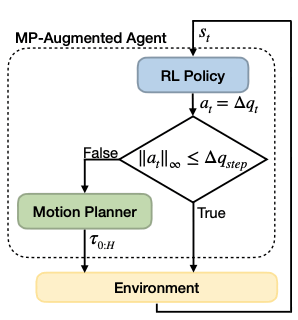
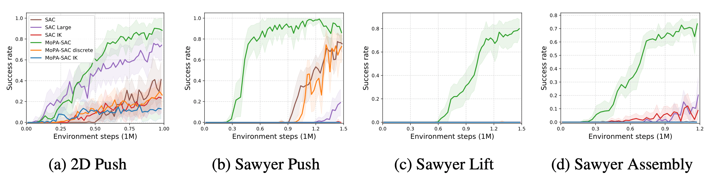

----

## Overview



To solve tasks in obstructed environments, we propose motion planner augmented reinforcement learning (<b>MoPA-RL</b>). Our framework consists of an <b>RL policy</b> and a <b>motion planner</b>. The motion planner is integrated into the RL policy by enlarging the action space. If a sampled action from the RL policy is in the original action space, an agent directly executes the action to the environment, otherwise the motion planner computes a path to move the agent to faraway points. MoPA-RL has three benefits:
<ul>
<li>Add motion planning capabilities to any RL agent with joint space control</li>
<li>Allow an agent to freely switch between MP and direct action execution  by controlling the scale of action</li>
<li>Naturally learn trajectories that avoid collisions by leveraging motion planning </li>
</ul>

----

## Videos

<span class="env-name"><b>Sawyer Push</b></span>
<p>Sawyer arm is required to find a path to reach an object inside of a box, and push it to a goal position.</p><br>
<div class="w3-row-padding">
	<div class="w3-col s4 w3-center">
		<video height="auto" width="100%" controls autoplay loop muted>
		  <source src="./video/sawyer_push_baseline.mp4" type="video/mp4">
		</video>
		<div class="method-name">SAC</div>
	</div>
	<div class="w3-col s4 w3-center">
		<video height="auto" width="100%" controls autoplay loop muted>
		  <source src="./video/sawyer_push_baseline_lg.mp4" type="video/mp4">
		</video>
		<div class="method-name">SAC Large</div>
	</div>
	<div class="w3-col s4 w3-center">
		<video height="auto" width="100%" controls autoplay loop muted>
		  <source src="./video/sawyer_push_mopa.mp4" type="video/mp4">
		</video>
		<div class="method-name">MoPA-SAC (Ours)</div>
	</div>
</div>
<span class="env-name"><b>Sawyer Lift</b></span>
<p>Sawyer arm needs to find a path to get inside a box, grasp a can and take it out from the box.</p><br>
<div class="w3-row-padding">
	<!-- <div class="w3-col s3 w3-center"> -->
	<!-- </div> -->
	<div class="w3-col s4 w3-center">
		<video height="auto" width="100%" controls autoplay loop muted>
		  <source src="./video/sawyer_lift_baseline.mp4" type="video/mp4">
		</video>
		<div class="method-name">SAC</div>
	</div>
	<div class="w3-col s4 w3-center">
		<video height="auto" width="100%" controls autoplay loop muted>
		  <source src="./video/sawyer_lift_baseline_lg.mp4" type="video/mp4">
		</video>
		<div class="method-name">SAC Large</div>
	</div>
	<div class="w3-col s4 w3-center">
		<video height="auto" width="100%" controls autoplay loop muted>
		  <source src="./video/sawyer_lift_mopa.mp4" type="video/mp4">
		</video>
		<div class="method-name">MoPA-SAC (Ours)</div>
	</div>
	<!-- <div class="w3-col s3 w3-center"> -->
	<!-- </div> -->
</div>
<span class="env-name"><b>Sawyer Assembly</b></span>
<p>Sawyer arm with an attached table leg needs to avoid other legs to reach a hole of the table, and insert the pole to assemble the table.</p><br>
<div class="w3-row-padding">
	<div class="w3-col s4 w3-center">
		<video height="auto" width="100%" controls autoplay loop muted>
		  <source src="./video/sawyer_assembly_baseline.mp4" type="video/mp4">
		</video>
		<div class="method-name">SAC</div>
	</div>
	<div class="w3-col s4 w3-center">
		<video height="auto" width="100%" controls autoplay loop muted>
		  <source src="./video/sawyer_assembly_baseline_lg.mp4" type="video/mp4">
		</video>
		<div class="method-name">SAC Large</div>
	</div>
	<div class="w3-col s4 w3-center">
		<video height="auto" width="100%" controls autoplay loop muted>
		  <source src="./video/sawyer_assembly_mopa.mp4" type="video/mp4">
		</video>
		<div class="method-name">MoPA-SAC (Ours)</div>
	</div>
</div>

----

## Quantitative results

<!--  -->

<div class="w3-row-padding">
    <div class="w3-col s1 w3-center"></div>
    <div class="w3-col s10 w3-center">
        <p>Success rates of our MoPA-SAC (green) and several baselines averaged over 4 seeds. Our approach can leverage the motion planner to converge with fewer environment steps than thebaseline. Both SAC and ours are trained for the same number of environment steps.</p>
        
    </div>
    <div class="w3-col s1 w3-center"></div>
</div>

----

## Citation
```
@inproceedings{yamada2020mopa,
  title={Motion Planner Augmented Reinforcement Learning for Obstructed Environments},
  author={Jun Yamada and Youngwoon Lee and Gautam Salhotra and Karl Pertsch and Max Pflueger and Gaurav S. Sukhatme and Joseph J. Lim and Peter Englert},
  booktitle={Conference on Robot Learning},
  year={2020},
}
```
